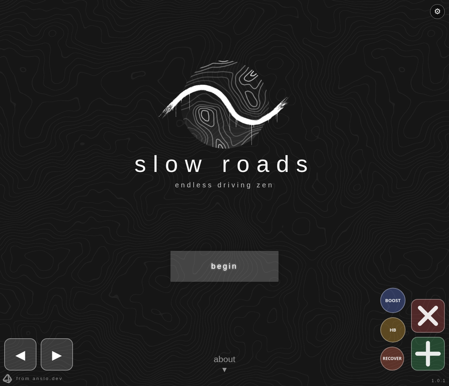

# Fast Roads

<p align="center">
  
</p>

<p align="center">
  <strong>A calm endless-driving experience, rebuilt for responsive cross-device play.</strong>
</p>

<p align="center">
  <a href="#features">Features</a> ·
  <a href="#controls">Controls</a> ·
  <a href="#pwa--offline-mode">PWA</a> ·
  <a href="#run-locally">Run locally</a>
</p>

## Live demo

Play the latest online build at **[driveinfinity.pages.dev](https://driveinfinity.pages.dev/)**.

## Overview

Fast Roads is a customized, mobile-friendly edition of the slow-roads driving experience. It keeps the meditative open-road feel while adding practical touch controls, configurable layouts, two-way AI traffic, collision feedback, and an installable offline-capable PWA shell.

> Drive at your own pace, arrange the controls your way, and meet traffic on the road.

## Features

| Area | What is included |
|---|---|
| Driving | Endless procedural road environment with desktop and touch input support |
| Traffic | Same-direction and oncoming AI vehicles with continuous movement and respawn handling |
| Accidents | Collision detection, slowdown, steering impulse, crash feedback, and cooldown protection |
| Touch UI | Dedicated left/right steering buttons, recover action, and persistent control layout editor |
| Customization | Drag, resize, show, hide, and save individual touch controls with `localStorage` |
| Performance | Mobile render-scale tuning and responsive viewport handling for iPad Safari and other devices |
| PWA | Installable manifest, service worker, offline shell caching, and mobile home-screen support |
| Interface | Cleaned-up feedback/donation UI and a custom About section |

## Controls

On mobile, use **◀** and **▶** to steer. Open **⚙ Settings** to edit the layout. Each control can be moved, resized, or hidden independently, and the chosen layout is saved automatically on the device.

Desktop keyboard input remains available through the original game controls. Use **RECOVER** whenever the vehicle leaves the road or needs to be repositioned.

## Two-way traffic

Traffic is maintained in two streams: vehicles travelling in the same direction as the player and vehicles approaching from the opposite direction. Cars are attached to the active rendered scene rather than a hidden vehicle-model subgroup, keeping them visible to the camera while the road origin moves. The traffic system also keeps running when the player is idle so cars do not disappear simply because the accelerator is not pressed.

When a vehicle intersects the player’s collision radius, Fast Roads applies a temporary slowdown and steering disturbance, displays a crash indicator, and uses a short cooldown to prevent repeated collision triggers in consecutive frames.

## PWA & offline mode

Fast Roads includes a web app manifest and service worker. After the first successful online load, the core HTML, JavaScript, CSS, controls, traffic code, icon, and selected static assets are cached. The site can then be launched from a mobile home screen and its application shell remains available when the network is unavailable.

For the best result, open the game once while online, wait for the initial loading sequence to finish, then choose **Install app** or **Add to Home Screen** from the browser menu.

## Run locally

The project is a static browser build. From the repository directory, serve it over HTTP rather than opening `index.html` directly, because service workers require an HTTP or HTTPS origin.

```bash
python3 -m http.server 8899
```

Then open:

```text
http://localhost:8899/index.html
```

The current project uses cache-busted script versions in `index.html`. If a browser appears to show an older build, perform a hard refresh or clear the site data before testing traffic and PWA updates.

## Project structure

```text
fastroads/
├── controls.js                 # Touch controls and layout customization
├── traffic.js                  # Two-way AI traffic and collision logic
├── ui-custom.js                # UI cleanup and custom About content
├── manifest.json               # Installable PWA metadata
├── sw.js                       # Offline cache and runtime asset strategy
├── docs/fastroads-preview.webp # README preview image
└── static/                     # Game bundle and static media
```

## Credits

Fast Roads is a custom modification built on top of the slow-roads browser driving experience. The project focuses on a lightweight interface, comfortable mobile controls, visible road traffic, and a smooth cross-device experience.

## License

Refer to the upstream project and repository history for the applicable licensing terms of the original game assets and code.
